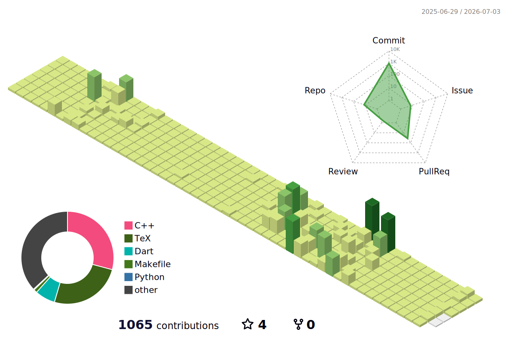

<h3 align="center">M.S. Student @ Gyeongsang National University</h3>

  Interested in XAI and Privacy-Preserving XAI

  
  

---

## About Me

I am an M.S. student at Gyeongsang National University. My research focuses on explainable artificial intelligence (XAI), with a particular interest in privacy-preserving explanation methods.

Recently, I have been exploring how XAI methods can be adapted to privacy-sensitive settings, especially under encrypted computation. I am interested in developing explanation systems that are both trustworthy and privacy-aware.

---

## Research Interests

- XAI
- Privacy-Preserving XAI

---

## Research Experience

### Argumentative XAI with Higher Fidelity
- Proposed a layer-aware mechanism to reduce fidelity loss in argumentative XAI
- Introduced quantitative metrics for fair and model-agnostic comparison
- Accepted to **CIKM 2025 (Full Paper)**

### Privacy-Preserving Argumentative Explanations
- Explored encrypted-domain generation of argumentative explanations
- Focused on computing explanations over ciphertexts so that only end users can decrypt them
- Accepted to **AAAI 2026 Student Abstract**

---

## Awards

- Silver Medal, Kaggle **"ICR - Identifying Age-Related Conditions"** Competition (126th)
- 2nd Prize (Grand Prize), **4th USG AI·Data Problem-Solving Manufacturing Innovation Contest**
- Excellence Award, **2024 Smart Manufacturing ICT Capstone Design Contest**
- 3rd Prize (Grand Prize), **5th USG AI·Data Problem-Solving Manufacturing Innovation Contest**

---

