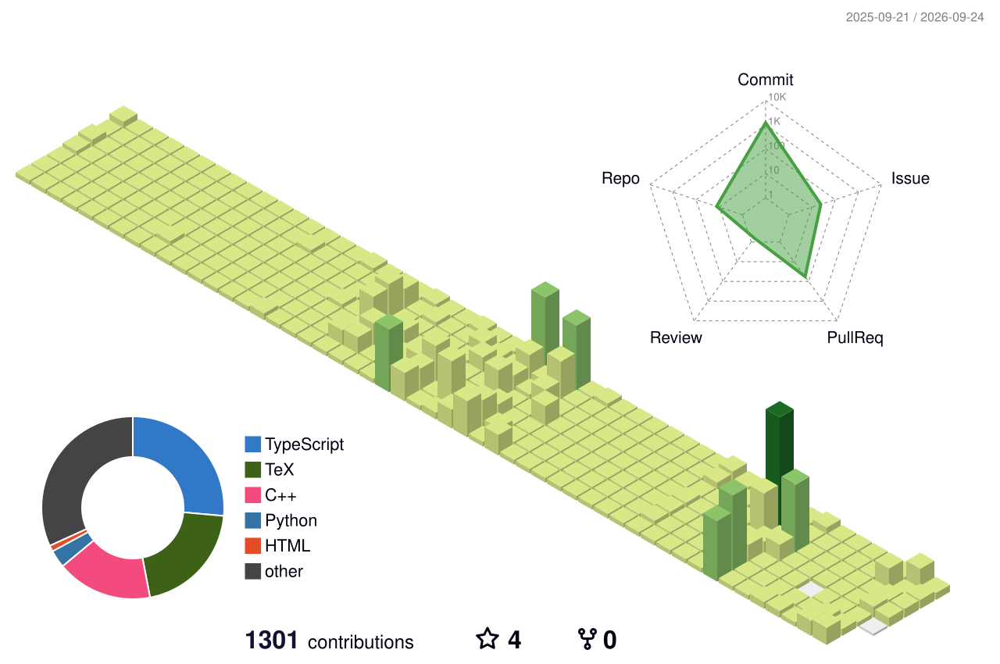

<h3 align="center">M.S. Student @ Gyeongsang National University</h3>

  Interested in Algorithms, Theory of Computation, Automata, and Efficient XAI

  
  
  
  

---

## About Me

I am an M.S. student at Gyeongsang National University. My current research interests lie in algorithms, theory of computation, and automata theory.

I am particularly interested in designing and optimizing algorithms for computational problems in explainable artificial intelligence (XAI), with an emphasis on efficiency, scalability, and rigorous analysis.

---

## Research Interests

- Algorithms and Optimization
- Theory of Computation
- Automata Theory
- Efficient Algorithms for XAI

---

## Research Experience

### Argumentative XAI with Higher Fidelity
- Proposed a layer-aware mechanism to reduce fidelity loss in argumentative XAI
- Introduced quantitative metrics for fair and model-agnostic comparison
- Accepted to **CIKM 2025 (Full Paper)**

### Encrypted-Domain Argumentative Explanations
- Explored algorithms for generating argumentative explanations over encrypted representations
- Focused on computational methods that allow explanations to be recovered only by end users
- Accepted to **AAAI 2026 Student Abstract**

### TRACE: Targeted Ranking-Aware Counterfactual Explanation for Sequential Recommendation
- Accepted to **ACM RecSys 2026 (Main Track)**

---

## Academic Service

- Program Committee Member, AAAI Conference on Artificial Intelligence (AAAI-27), 2027

---

## Awards

- Silver Medal, Kaggle **"ICR - Identifying Age-Related Conditions"** Competition (126th)
- 2nd Prize (Grand Prize), **4th USG AI·Data Problem-Solving Manufacturing Innovation Contest**
- Excellence Award, **2024 Smart Manufacturing ICT Capstone Design Contest**
- 3rd Prize (Grand Prize), **5th USG AI·Data Problem-Solving Manufacturing Innovation Contest**

---

